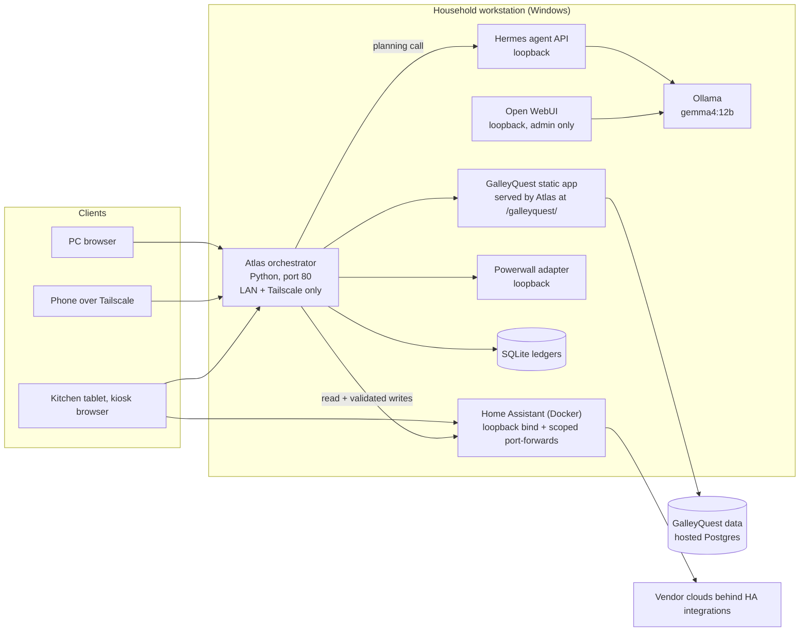

# Atlas Home Command Center

A local-first household platform for one home: a family dashboard, pantry and meal planning (GalleyQuest), Home Assistant device control, and a local AI assistant that can only act through a small set of validated connectors. Everything runs on one Windows workstation in the house. There is no cloud host, no public tunnel, and no metered AI fallback.

This repository is a sanitized publication of a working private deployment. Sample data is illustrative. Household names, addresses, device identifiers, and credentials have been removed or replaced.

## Why it exists

Most "smart home" stacks put a phone app in front of each vendor cloud and an LLM in front of everything. Atlas takes a different position:

- Deterministic safety (fire, water leak, freeze, alarm, emergency stop) never depends on an LLM, a cloud provider, or internet access.
- One shell for the family, reachable from PCs on the LAN, phones over a Tailscale mesh, and a kitchen tablet running a kiosk browser.
- Local inference only. A model can propose an action; it cannot grant itself authority to perform one.
- Evidence over assurance. Every AI request, policy decision, and household command is written to a local ledger, and the user-facing answer is replaced by what was actually observed after the command.

## What the family uses day to day

| Surface | What it does |
|---|---|
| Home | Greeting by household profile, HVAC setpoint, indoor range and AQI, battery and solar, pantry shortages, selected lights |
| Environment | Thermostat control, multi-room temperature and humidity, air quality, weather and radar, 24-hour trends |
| Energy | Live solar, battery, and grid power from a Tesla Powerwall adapter, calendar history, billing-cycle estimates |
| Security | Camera awareness, Windows host cyber-health snapshot, and a separate vacation-only secondary motion IDS with arm/confirm |
| Pantry | Planned meals, missing ingredients, cart, and staples, read from GalleyQuest |
| Travel | Local trip ledger with readiness and case tracking |
| Maintenance | Household service schedule and completed-service records entered by people, not inferred from sensors. This module replaced the earlier "Health" workspace; personal health is out of scope |
| Systems | Normalized service, container, and safety-control health |
| Agents | "Chat with Atlas": full-viewport chat with the local Hermes assistant |

Each Atlas module carries a Greek or Roman identity (Vesta for Home, Sol for Energy, Aeolus for Environment, Titan for Security, Demeter for Pantry, Oracle for Travel, Vulcan for Maintenance, Athena for Systems, Olympus for Agents, and Hermes as the assistant). The names are deliberate and partly educational: the household learns the mythology while using the tools. GalleyQuest keeps its own name and mascot on purpose, but its layout, palette, and integration match Atlas.

The kitchen tablet runs a Home Assistant dashboard in kiosk mode: clock, weather, HVAC, fridge and freezer doors and temperatures, water filter, washer and dryer state, a water-leak banner that only appears when a sensor is wet, garage door with open and close, porch and hallway lights, doorbell and motion recency, three camera live views, and two image cards that open GalleyQuest and Chat with Atlas in the same window. Card images are served by Home Assistant or the Atlas host by IP address, so the tablet never depends on resolving a short hostname.

## Architecture

Components, as implemented:

- **Atlas orchestrator.** A Python package with a threaded HTTP server that serves the web shell, exposes read routes (status, energy, environment history, filtered Home Assistant entities, GalleyQuest status, household state), and a small set of write routes (chat, HVAC setpoint, selected lights, household messages and profiles, vacation IDS, camera signaling). Writes require a trusted client network and a same-origin request. General orchestration and sandbox action routes stay loopback-only unless remote writes are explicitly enabled, and they are not enabled.
- **Provider layer.** One normalized contract for Ollama, OpenAI, Anthropic, and xAI. Cloud adapters are inert until a key and model are configured, and any request naming a cloud provider also needs a positive spend limit. In the deployed household configuration no cloud key is set, so the only available model provider is the local one.
- **Operating charter.** The owner's AI operating rules are a versioned Markdown file whose SHA-256 is verified on every AI request. The full text is included in the system prompt. A missing or altered charter stops AI requests with an error rather than falling back to an unruled prompt. Manual controls and health endpoints do not depend on the charter loading.
- **Home Assistant.** Runs in Docker with the container port published on loopback only. Atlas reaches it with a server-side long-lived token that is never sent to the browser. LAN and Tailscale access to the tablet dashboard use explicit Windows port-forwards on specific interface addresses plus matching inbound firewall rules, not a wildcard listener.
- **GalleyQuest.** A vanilla JavaScript single-page app served by Atlas from its own checkout. Atlas rewrites the app's config file at request time so the data-store URL and public anon key come from the Windows Credential Manager, and it sets a content security policy that allows only that origin. See the GalleyQuest section for the data-store status.
- **Energy adapter.** A Node.js service that reads the Tesla Powerwall gateway and publishes a loopback JSON API and InfluxDB history. It carries its own ISC license notice.
- **Runtime recovery.** A signed-in-user scheduled task supervises the Atlas and energy processes. It restarts missing processes with backoff and a circuit breaker, never kills a hung process, never sends device commands, and honors a persistent maintenance pause. A 20-minute health task probes nine loopback services and six containers and records the result for the Systems page.
- **Secrets.** Stored in Windows Credential Manager under a namespaced prefix, read by the launcher at start, injected as process environment, and cleared from the launcher's environment immediately after the child starts. Ledger values are redacted against the configured secrets.

## Local AI and bounded device control

The Agents page and the kitchen "Chat with Atlas" card use the same `/v1/chat` route. The flow is:

1. Atlas first checks whether the message is a basic read-only status question (leak sensors, dryer or washer, fridge and freezer doors, garage, thermostat, approved lights, TVs). If so it answers from a fresh Home Assistant read with no model call, and records the observation in the ledger.
2. Otherwise Atlas sends one planning request to the local Hermes agent API, which runs the model through Ollama. The request includes the full charter, the conversation history (bounded), a catalog of the allowed tools, and the commands Atlas's own grammar already recognized in the latest message.
3. Hermes returns a JSON answer plus typed `tool_commands`. Hermes is configured with only web, memory, and session-search tools on this platform, and no MCP, shell, file, browser, cron, or delegation tools, so it cannot execute anything on its own.
4. Atlas compares the model's proposal against its own independent parse of the current message. Only an exact match proceeds. Conversation history, memory, and device labels cannot authorize a write.
5. For each command Atlas reads fresh state, skips commands that are already satisfied, sends at most one service call with no automatic retries, then polls for the requested state and reports what it observed. If the service call errors, Atlas re-reads before reporting failure.
6. The observed outcome replaces the model's proposed answer. `dry_run: true` validates the plan and reads state without any write; previews are labeled as previews.

Approved tools in the current build:

- Close the garage (close only, and only when the configured entity reports `device_class: garage` and an open or closing state).
- Thermostat target as a whole number from 60 to 85 °F, plus HVAC mode and fan mode when the thermostat advertises them.
- Power for six named lights and plugs.
- Power for two registered TVs, only when Home Assistant reports the device available and advertises the requested power capability.

Everything else is refused: TV volume or inputs, appliance starts, cameras, locks, alarms, garage opening, purchases, arbitrary switches, and anything conditional, quoted, or ambiguous. Unsupported imperative commands are answered with a refusal, never a model-written success claim.

What this is, and is not:

- Session history is kept by Hermes per session id, and Hermes has a saved memory and skills directory. That is stored context, not model training. Atlas does not retrain or fine-tune anything.
- Escalation is manual. When a request would benefit from a second model, Atlas says so and prepares a copyable, sanitized handoff for the person to paste into an existing assistant subscription. No metered API is called automatically.
- Model in service: Google Gemma 4 12B (Q4_K_M) through Ollama, with Atlas overriding the context window to 16,384 tokens, temperature 0, and a 512-token answer. Microsoft Phi-4 14B is also installed and is the standalone Hermes default. The maintainers exclude models of Chinese origin; the last such tag was removed from the runtime.
- Verified so far: the garage close path worked end to end through Home Assistant and the garage integration, and a request against an already-closed door correctly returned "already closed" without sending a command. TV power and HVAC mode were validated in dry-run only. The mocked command test suite (16 tests) and the wider regression suite (195 tests) pass. These tests do not prove model obedience or physical movement.

## GalleyQuest: pantry, recipes, meals, and shopping handoffs

GalleyQuest tracks stock, recipes, a weekly meal plan, and a grocery list with `on list`, `ordered`, and `pending pickup` states. Shopping is designed for a premium assistant subscription with browser control (ChatGPT or Claude), not a metered API. The "Shop with AI", "Train AI", and "After Pickup" buttons prepare a prompt (charter plus the current stock, recipes, plan, and cart) that the person copies into their assistant. The assistant can work more than one store, prepares each cart, and must stop before selecting a pickup time or completing a purchase. After pickup, a separate reconciliation workflow updates stock from the receipt. Nothing in GalleyQuest orders groceries automatically, and cart preparation does not mark items ordered or change stock.

Data store status, stated plainly:

- The live site served by Atlas uses a hosted Postgres project (Supabase) through the browser SDK. That is what the family uses today.
- A local SQLite service with tenant-scoped records, transactional audit, quantity commands, and a local "chef" chat exists as an isolated preview bound to loopback. It reports `live_cutover: false`. Migration to it is planned, not done.
- The live meal table lacks a `slot` column that the Save button writes, so meal saving through the web page is not yet dependable. An additive repair is prepared but has not been applied.

## Network, access, and recovery

Boundaries as designed and, where noted, as verified on the deployed host:

- Atlas binds port 80 and trusts only loopback, the home LAN subnet, and the Tailscale CGNAT range at the application layer. The host firewall admits the LAN and named Tailscale peers.
- Home Assistant's container port is published on loopback. Two explicit port-forwards expose it on the host's LAN address and Tailscale address, each paired with an inbound rule limited to that local address, port, remote range, and interface. Verified: the dashboard and the kitchen view answer on loopback, LAN, and Tailscale; Atlas and GalleyQuest answer on all three as well.
- Ollama, the Hermes API, Open WebUI, the GalleyQuest local preview, the energy adapter, InfluxDB, Grafana, SearXNG, and ntfy are loopback-only by design and are not exposed on the LAN or Tailscale. The health monitor treats any non-loopback listener on a support port as unsafe unless it matches the exact approved Home Assistant exception. Family-facing AI chat is the Atlas Agents page; Open WebUI is an administration tool on the host only.
- Windows Firewall rules, Tailscale ACLs, and Atlas's trusted-network list are three different layers. A rule in one does not imply the others.
- Recovery: versioned configuration snapshots with hashes, dated recovery folders with SQLite online backups, integrity checks, and isolated schema and row-count restores before each material change. A full reboot and sign-in test and a complete disaster-recovery restore have not been performed. A successful sample restore is not proof of full recoverability.

## Implemented, verified, and planned

Implemented and used daily:

- Family dashboard with nine modules, household profiles, and messages
- Kitchen tablet dashboard with device controls and launch cards
- Read-only status answers and bounded device commands through chat
- Charter verification on every AI request
- GalleyQuest planning, stock, and copy-to-assistant shopping handoffs
- Powerwall telemetry and history
- Runtime recovery supervisor and periodic health controls

Verified by test or live observation, with limits:

- Garage close and already-closed no-op (live)
- Dry-run previews for TV power and HVAC mode and fan (live, no writes)
- Regression suite: 195 Python tests, plus browser syntax checks
- SQLite checkpoint integrity and isolated restores (sample only)

Planned or not yet dependable:

- GalleyQuest cutover to the local database and quantity-aware shortages
- Meal saving repair on the live store
- Charter endpoint at the live GalleyQuest route (the handoff buttons currently cannot verify the charter)
- Ollama listener reconciliation and Hermes resource budgets for unattended work
- Previous-chat browsing on the Agents page
- Reboot and disaster-recovery drills
- Voice, calendar, contractor estimates, and maintenance automation

## Lineage

Atlas replaced an earlier home lab stack (JARVIS 5000, now retired). Its useful systems were pulled into Atlas with design changes to match the Atlas shell; Docker services and databases were merged and simplified, and the rest were retired. GalleyQuest began as a standalone pantry app with its own repository; that repository is now superseded by the version integrated here.

## Deployment prerequisites

- Windows 10 or 11 workstation with Docker Desktop, Python 3.12+, Node.js, Ollama, and a GPU with roughly 12 GB VRAM for the 12B model
- Home Assistant with the integrations for your devices (this home uses a Daikin thermostat, Ring cameras, YoLink leak sensors, SmartThings appliances, TP-Link lights, and an Aladdin Connect garage controller)
- A Tailscale tailnet for phone access
- A Supabase project for GalleyQuest until the local store is cut over
- Windows Credential Manager entries for the Home Assistant token and the GalleyQuest anon key

Honest limitations:

- Single household, single host, single point of failure. Not multi-tenant, not hardened for the public internet, no HTTPS on the LAN.
- Chat writes are gated by network trust and same-origin checks, not by per-user authentication.
- Vendor clouds still sit behind several Home Assistant integrations even though inference and the execution boundary are local.
- Availability depends on a signed-in user session for the recovery task; pre-login operation is not provided.
- Finances and personal health are out of scope by design.

## License

MIT. The Powerwall adapter retains its original ISC notice in `THIRD_PARTY_NOTICES.md`. Home Assistant, Open WebUI, Ollama, Hermes, and the Supabase client are separate projects under their own licenses and are not redistributed here except where noted.
